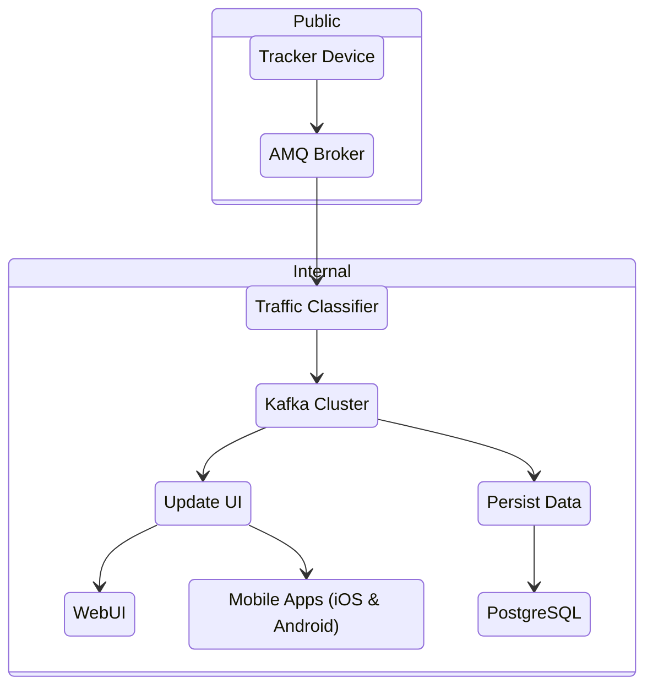

# Overview

The CEREBRAL STRATUM backend is made up of several components:

1. **User Interaction**
    - REST API
    - Websockets
2. **Tracker Device Interaction**
    - Classifier - classifies incoming data, such as:
        - Location
        - CAN bus
    - MQTT
3. **Database**
    - PostgreSQL
> **Note**
>
> BlueGuardian Co uses CrunchyData to host highly available PostgreSQL
4. **Service Message Bus**
    - Kafka
5. **Platform**
    - Kubernetes, Podman, or Docker
> **Note**
> 
> BlueGuardian Co hosts these components on Red Hat OpenShift Container Platform

## High Level Traffic Flow

